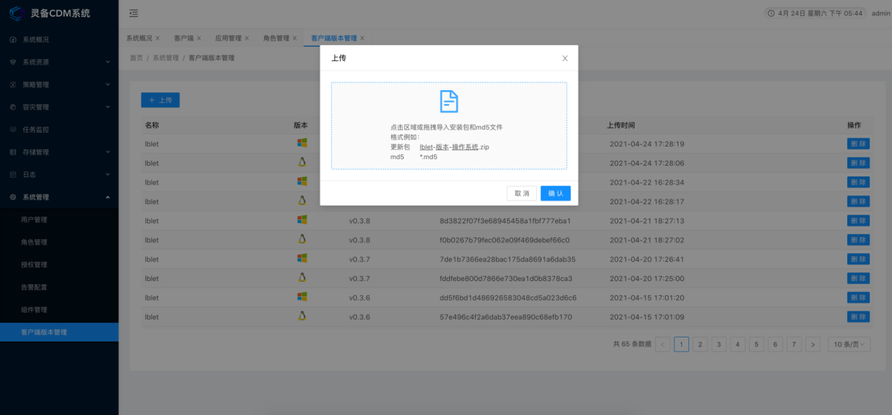

> - CDM 相关的依赖保存在解压后的 module 目录下

# 0.1 配置本地 yum 源

yum安装依赖包之前，请⾃⾏配置好yum本地源，以下为示例操作：

```bash
# 需要修改并启⽤相关的service。因为编译⽣成的⼀些service中，可执⾏⽂件的路径、其使⽤的配置⽂件路径有错误。
# 如果是虚拟机，编辑虚拟机设置，分配系统镜像给CDROM，勾选已连接建⽴挂载点，挂载 CDROM
mkdir /mnt/cdrom/
mount /dev/cdrom /mnt/cdrom/

# 如果是物理机，上传镜像到某⽬录，以下示例为上传到/root下
# 建⽴挂载点，挂载CDROM
mkdir /mnt/cdrom
mount -o loop /root/CentOS-7.7-x86_64-DVD-1908.iso /mnt/cdrom

# 移⾛官⽅⾃带的联⽹repo源
mkdir /etc/yum.repos.d/repoBackup
mv /etc/yum.repos.d/*.repo /etc/yum.repos.d/repoBackup

# ⽣成本地repo源
cat < /etc/yum.repos.d/dvd.repo
[dvd]
name=dvd
baseurl=file:///mnt/cdrom
gpgcheck=0
enabled=1
EOF

# 重新⽣成yum缓存
yum clean all
yum makecache
```

#  一、安装存储组件

## 1.1 安装 zfs

编译安装 zfs

```bash
# 安装依赖
yum -y install kernel-devel zlib-devel libuuid libblkid-devel lib ssl-devel openssl-devel libudev-devel libattr-devel libaio-devel python2-devel python-cffi python-setuptools libffi-devel gcc gcc-c++

# 上传好zfs源码包，开始编译安装
tar -xzvf zfs-0.8.6.tar.gz
cd zfs-0.8.6
./configure
make -j $(nproc) && make install

# 以下是需要启⽤的service
[root@lbserver ~]# systemctl list-unit-files | grep enabled | grep zfs
zfs-import-cache.service enabled
zfs-mount.service enabled
zfs-share.service enabled
zfs-volume-wait.service enabled
zfs-zed.service enabled
zfs-import.target enabled
zfs.target enabled

# 启⽤上述的service
systemctl enable zfs-import-cache.service
systemctl enable zfs-mount.service
systemctl enable zfs-share.service
systemctl enable zfs-volume-wait.service
systemctl enable zfs-zed.service
systemctl enable zfs-import.target
systemctl enable zfs.target

# 修改启动脚本
mkdir /etc/zfs
sed -i "s!ConditionPathExists=/usr/local/etc/zfs/zpool.cache!ConditionPathExists=/etc/zfs/zpool.cache!g" /usr/lib/systemd/system/zfs-import-cache.service

sed -i "s!ExecStart=/usr/local/sbin/zpool import -c /usr/local/etc/zfs/zpool.cache -aN!ExecStart=/usr/local/sbin/zpool import -c /etc/zfs/zpool.cache -aN!g" /usr/lib/systemd/system/zfs-import-cache.service

systemctl daemon-reload
```

优化 zfs 参数

```bash
mkdir /etc/zfs.modules.d

cat <<EOF > /etc/zfs.modules.d/zfs.conf
# max active per top-level vdev
options zfs zfs_vdev_max_active=1024
# min/max active requests for leaf-level vdevs
options zfs zfs_vdev_async_read_max_active=32
options zfs zfs_vdev_async_read_min_active=2
options zfs zfs_vdev_scrub_max_active=4
options zfs zfs_vdev_scrub_min_active=1
options zfs zfs_vdev_sync_read_max_active=32
options zfs zfs_vdev_sync_read_min_active=2
options zfs zfs_vdev_sync_write_max_active=32
options zfs zfs_vdev_sync_write_min_active=2
options zfs zfs_vdev_async_write_max_active=32
options zfs zfs_vdev_async_write_min_active=2
# Limut device utilization to 85% to control fragmentation
options zfs zfs_mg_noalloc_threshold=15
EOF
```

添加开机启动加载 zfs 模块

```bash
cat <<EOF > /etc/sysconfig/modules/zfs.modules
modprobe zfs
EOF

chmod +x /etc/sysconfig/modules/zfs.modules
```

启动 zfs

```bash
# 加载zfs内核
modprobe zfs

# 启动zfs服务
systemctl start zfs.target
systemctl start zfs-import.target
systemctl start zfs-import-cache.service
systemctl start zfs-mount.service
systemctl start zfs-share.service
systemctl start zfs-volume-wait.service
systemctl start zfs-zed.service

# 检查zfs内核加载状况
lsmod | grep zfs
zfs 3986613 12
zunicode 331170 1 zfs
zlua 147429 1 zfs
zcommon 89551 1 zfs
znvpair 94388 2 zfs,zcommon
zavl 15167 1 zfs
icp 288913 1 zfs
spl 104299 5 icp,zfs,zavl,zcommon,znvpair
```

## 1.2 安装 scst

编译安装

```bash
# 安装依赖
yum install -y bzip2 gcc perl-ExtUtils-CBuilder perl-ExtUtils-Make Maker cpan parted psmisc

# 上传好scst源码包，解压
tar -xjvf scst-3.5.0.tar.bz2
cd scst-3.5.0
```

> 注意，编译安装的时候，⼀定要先编译安装scst，然后再编译安装iscsi-scst、scstadmin

```bash
cd scst
make -j $(nproc) all && make install
cd ../iscsi-scst
make -j $(nproc) all && make install
cd ../scstadmin
make -j $(nproc) all && make install
```

修改启动文件

```bash
sed -i 's/SCST_MODULES="scst"/SCST_MODULES="scst scst_vdisk iscsi_scst"/g' /etc/rc.d/init.d/scst
```

设置开机自启

```bash
systemctl enable scst
```

启动 scst

> 注: 新建scst的配置⽂件后再启动scst

```bash
touch /etc/scst.conf
systemctl start scst

# 查看状态
systemctl status scst

# 查看内核模块加载状态
lsmod | grep scst
scst_vdisk 102916 0
isert_scst 52353 4
iscsi_scst 91603 14 isert_scst
scst 1012335 2 iscsi_scst,scst_vdisk
rdma_cm 59991 7
rpcrdma,ib_srp,ib_iser,ib_srpt,isert_scst,rdma_ucm,ib_isert
ib_core 255469 13
rdma_cm,ib_cm,iw_cm,rpcrdma,ib_srp,ib_iser,ib_srpt,ib_umad,isert_scst,ib_uverbs,rdma_ucm,ib_ipoib,ib_isert
dlm 169839 1 scst
libcrc32c 12644 3 xfs,iscsi_scst,scst_vdisk
crc_t10dif 12912 3 scst,target_core_mod,sd_mod
```

## 1.3 安装 nfs (可选)

```bash
yum -y install rpcbind nfs-utils

# 启动nfs并添加开机⾃启
systemctl enable nfs
systemctl start nfs
```

## 1.4 添加 VDDK 的库文件

```bash
#### 解压库⽂件，移动到对应⽬录下

tar -xzvf VMware-vix-disklib-6.7.2-13015725.x86_64.tar.gz
mv vmware-vix-disklib-distrib /usr/lib/vmware-vix-disklib

#### 将库⽂件的路径写⼊系统环境路径并刷新
echo "/usr/lib/vmware-vix-disklib/lib64" > /etc/ld.so.conf.d/vmware-vixdisklib.conf
ldconfig
```

## 1.5 安装 lb-storage

```bash
# 建⽴相关路径， 解压安装包
mkdir /opt/howlink/cdm
mv storage-linux_amd64.tar.gz /opt/howlink
cd /opt/howlink/cdm
tar -xvf storage-linux_amd64.tar.gz

# 创建⽬录
mkdir -p ./{storage,logs}

# 复制lb-storage启动脚本
cp systemed/lb-storage.service /usr/lib/systemed/system/storage.service

# 配置开机启动
systemctl enable lb-storage
systemctl start lb-storage

# 修改配置⽂件
cat config/lb-storage.conf
SERVER_NAME=$NAME
SERVER_ADDRESS=$IP
STORE_DIR=/opt/howlink/cdm/storage
```

# 二、安装服务端组件

## 2.1 安装 postgres

```bash
# 在线安装
# Install the repository RPM:
sudo yum install -y https://download.postgresql.org/pub/repos/yum/reporpms/EL-7-x86_64/pgdg-redhat-repo-latest.noarch.rpm

# Install PostgreSQL:
sudo yum install -y postgresql12-server

# 离线安装
yum localinstall postgresql12-contrib-12.6-1PGDG.rhel7.x86_64.rpm postgresql12-libs-12.6-1PGDG.rhel7.x86_64.rpm postgresql12-server-12.61PGDG.rhel7.x86_64.rpm postgresql12-12.6-1PGDG.rhel7.x86_64.rpm

# 初始化配置

# 配置数据库数据⽂件路径
root$ mkdir /usr/local/pgsql
root$ chown postgres /usr/local/pgsql3

# yum安装依赖包之前，请⾃⾏配置好yum本地源，以下为示例操作：
root$ su postgres
# 配置初始⽤户密码和数据库连接验证⽅式
postgres$ /usr/pgsql-12/bin/initdb -D /usr/local/pgsql/data -W -A md5
#$ password: ?

# 配置远程连接
root$ vim /var/lib/pgsql/12/data/postgresql.conf
...
listen_addresses = 'localhost'

# 启动数据库
root$ sudo systemctl enable postgresql-12
root$ sudo systemctl start postgresql-12

$ psql -U postgres -W
```

服务端需要安装 etcd、lb-admin、lb-gateway、lb-workflow、lb-connector

```bash
# 建⽴相关路径， 解压安装包10
mkdir /opt/howlink/cdm
mv server-linux_amd64.tar.gz /opt/howlink
cd /opt/howlink/cdm
tar -xvf server-linux_amd64.tar.gz 
```

## 2.2 安装 etcd

```bash
# 创建⽬录
mkdir /etcd-data

# 复制etcd启动脚本
cp systemed/etcd.service /usr/lib/systemed/system/etcd.service

# 修改配置⽂件
cat /opt/howlink/cdm/config/etcd.conf
#[Member]
ETCD_NAME="etcd01"
ETCD_DATA_DIR="/etcd-data"
ETCD_LISTEN_PEER_URLS="http://$IP:2380"
ETCD_LISTEN_CLIENT_URLS="http://$IP:2379"

#[Clustering]
ETCD_INITIAL_ADVERTISE_PEER_URLS="http://$IP:2380"
ETCD_ADVERTISE_CLIENT_URLS="http://$IP:2379"
ETCD_INITIAL_CLUSTER="etcd01=http://$IP:2380"
ETCD_INITIAL_CLUSTER_TOKEN="etcd-cluster"
ETCD_INITIAL_CLUSTER_STATE="new"

#[Compaction]
ETCD_AUTO_COMPACTION_RETENTION=2
ETCD_MAX_REQUEST_BYTES=33554432
ETCD_QUOTA_BACKEND_BYTES=8589934592

# 配置开机启动
systemctl start etcd
systemctl enable etcd
```

## 2.3 安装 lb-admin

```bash
# 创建⽂件
mkdir -p /opt/howlink/cdm/upload

# 复制lb-storage启动脚本
cp systemed/lb-admin.service /usr/lib/systemed/system/lb-admin.service

# 修改配置⽂件
cat config/config.ini

# cdm
service.group = com.howlink.cdm

...

[registry]
# 内存⽅式：etcd、mdns
name = etcd
address = $IP:2379

...

[admin]
bind.address = $IP:8080
upload = /opt/howlink/cdm/upload

...

[workflow]
bind.address = $IP:8081

[datasource]
DSN = host=IP user=postgres password=$PASSWORD dbname=postgres port=5432 sslmode=disable TimeZone=Asia/Shanghai
Idle = 20
Active = 100
LogLevel = 5
SlowThreshold = 1
IdleTimeout = 3600000

...

[customer]
name=豪联科技内⽹

# 配置开机启动
systemctl enable lb-admin
```

## 2.4 安装 gateway

```bash
# 复制lb-storage启动脚本
cp systemed/lb-gateway.service /usr/lib/systemed/system/lb-gateway.service

# 修改配置⽂件
cat config/config.ini

...
[gateway]
api.address = $IP:9000
static = /opt/howlink/cdm/static
...

# 配置开机启动
systemctl enable lb-gateway

# 将前端编译包解压到 /opt/howlink/cdm/static ⽬录
```

## 2.5 安装 workflow

```bash
# 创建⽂件
mkdir -p /opt/howlink/cdm/data

# 复制lb-storage启动脚本
cp systemed/lb-workflow.service /usr/lib/systemed/system/lb-workflow.service

# 修改配置⽂件
cat config/config.ini

# 这⼉是connector对外的地址，必须是lblet可以访问的地址
connector.address=$IP:8090
...
[connector]
#必须指定绑定地址、端⼝，因为LBLet是要根据ip:port访问
bind.address = $IP:8090
data = /opt/howlink/cdm/data

[workflow]
bind.address = $IP:8081
...

# 配置开机启动
systemctl enable lb-workflow
```

## 2.6 安装 connector

```bash
# 复制lb-storage启动脚本
cp systemed/lb-connector.service /usr/lib/systemed/system/lb-connector.service

# 修改配置⽂件
cat config/config.ini

...
[connector]
#必须指定绑定地址、端⼝，因为LBLet是要根据ip:port访问
bind.address = $IP:8090
data = /opt/howlink/cdm/data
...

# 配置开机启动
systemctl enable lb-connector
```

## 2.7 启动服务

```bash
systemctl start etcd
systemctl start lb-gateway
systemctl start lb-workflow
systemctl start lb-admin
systemctl start lb-connector
```

> 注: 将修改后的 config.ini ⽂件复制到 /root/.howlink/cdm/ 下，防⽌组件更新覆盖配置⽂件

# 三、安装客户端

## 3.1 Linux 下部署

```bash
上传安装包到服务器后，在指定路径解压
mkdir /opt/howlink/cdm
mv lblet-linux_amd64.zip /opt/howlink
cd /opt/howlink
unzip lblet-linux_amd64.zip -d /opt/howlink/cdm 
```

### 3.1.1 安装 iscsiadm

当前版本的lblet，依赖于iSCSI客户端（即将⽀持FC），在启动lblet之前，需要安装iSCSI客户端。安装可以通过直接上传rpm包安装，也可以挂载系统镜像使⽤yum本地源安装。
公司NAS上提供了 Linux 6 和 Linux 7 版本的rpm包，两个版本安装过程有所区别：

```bash
# 上传rpm到指定位置后进⾏安装
# Linux 6
rpm -ivh iscsi-initiator-utils-6.2.0.873-27.el6_9.x86_64.rpm

# Linux 7
rpm -ivh iscsi-initiator-utils-iscsiuio-6.2.0.874-11.el7.x86_64.rpm
rpm -ivh iscsi-initiator-utils-6.2.0.874-11.el7.x86_64.rpm
```

### 3.1.2 修改lblet的配置⽂件

以下是 /opt/howlink/cdm/config/config.ini 内容：

```bash
cat /opt/howlink/cdm/config/config.ini
# 需改lblet名称，该值唯⼀
name = orac1
# cdm
service.group = com.howlink.cdm

# 这⼉是connector对外的地址，必须是lblet可以访问的地址
connector.address=$SERVER_IP:8089

[lblet]
scripts=/opt/howlink/cdm/static
point=/opt/howlink/cdm/touch
cdm-oracle=/opt/howlink/cdm/bin/cdm-oracle
cdm-disk=/opt/howlink/cdm/bin/cdm-disk
```

修改完后将文件复制到 /root/.howlink/cdm/config.ini，防止lblet更新时被修改。

> 注：配置文件请直接在 linux 上修改，因为 windows 上修改的文件会改变文件的字符集格式，使得 linux 程序识别出错。

### 3.1.3 设置启动脚本

Linux 6使⽤service进⾏服务管理，到了Linux 7，则使⽤systemctl来进⾏服务管理，systemctl向下兼容service命令。所以，根据lblet所在的操作系统版本，启动脚本的部署⽅式也有所区别：

```bash
# linux6
# 复制启动脚本
cp /opt/howlink/cdm/systemed/lblet.sh /etcd/init.d/lblet
chmod +x /etc/init.d/lblet

# 开机启动 lblet
chkconfig --add lblet | chkconfig on lblet

# linux7
# 复制启动脚本
cp systemed/lblet.service /usr/lib/systemed/system/lblet.service

# 开机启动 lblet
systemctl enable lblet
```

### 3.1.4 启动 lblet

由于服务管理⽅式不同，启动⽅式也有所区别：

```bash
# Linux 6
service lblet start

# Linux 7
systemctl lblet start
```

## 3.2 windows 下部署

将压缩包上传⾄服务器，创建⽬录 C:\howlink，将压缩包解压⾄该⽬录下

### 3.2.1 启动iSCSI服务

与Linux的相同，当前版本的lblet，依赖于iSCSI客户端（即将⽀持FC），在启动lblet之前，需要先启动iSCSI服务。打开“iSCSI发起程序”，如果提示服务尚未运⾏，请单击“是"以启动该服务。

### 3.2.2 同意协议

由于SQLServer和MySQL会调⽤sync.exe，该程序⾸次运⾏需要同意协议，故这两种备份需要同意程序的使⽤协议：双击运⾏C:\howlink\cdm\scripts\sync.exe，点击“同意”按钮即可。

### 3.2.3 测试VSS

由于SQLServer和MySQL的备份需要调⽤VSS（卷影复制），故使⽤lblet之前需要测试VSS能否正常运⾏。
在CMD窗⼝或PowerShell下运⾏此命令：
如果返回值报错，缺少依赖等，请按照提示安装依赖，依赖包已放置于公司NAS指定位置。
依赖中包括.NET4.5和VC++运⾏库。如果返回值最后⼀⾏为“True”，则继续执⾏，成功执⾏将会返回“True”

### 3.2.4 修改配置⽂件

修改lblet的配置⽂件，以下是 config/config.ini 内容：

```bash
cat /opt/howlink/cdm/config/config.init
# 需改lblet名称，该值唯⼀

name = orac1
# cdm
service.group = com.howlink.cdm

# 这⼉是connector对外的地址，必须是lblet可以访问的地址
connector.address=$SERVER_IP:8089

[lblet]
scripts=C:\howlink\cdm\static
point=C:\howlink\cdm\touch
cdm-oracle=C:\howlink\cdm\bin\cdm-oracle
cdm-disk=C:\howlink\cdm\bin\cdm-disk
```

### 3.2.5 启动 lblet

为了⽅便运⾏，建议新建批处理⽂件start.bat，内容如下：

```bash
C:\howlink\cdm\bin\lblet.exe
```

推荐将该脚本拖拽⼊PowerShell窗⼝，回⻋以运⾏。

> 注：PowerShell 必须以管理员方式启动

## 3.3 更新 lblet

CDM3.1 ⽀持lblet启动更新，解压 cdm.tar.gz 包获取 lblet 的上传到指定⻚⾯：



# 四、使用 cdm-dp 部署

cdm-dp 工具是 cdm 项目的部署工具、可以帮助用户快速部署 cdm 的各种组件。

cdm-dp 存放在 cdm.tar.gz 压缩包中，支持三种平台

```bash
[root@localhost cdm]# ll
总用量 227592
-rw-r--r--. 1 root root  10096787 12月 31 09:44 dp-linux_amd64.tar.gz
-rw-r--r--. 1 root root   6992170 12月 31 09:45 dp-linux_arm64.tar.gz
-rw-r--r--. 1 root root  14278990 12月 31 09:45 dp-windows_amd64-.zip
drwxr-xr-x. 2 root root       202 12月 31 09:46 lblets
drwxr-xr-x. 3 root root       143 12月 30 14:41 module
-rw-r--r--. 1 root root 103992110 12月 31 09:44 server-linux_amd64.tar.gz
-rw-r--r--. 1 root root  74248501 12月 31 09:43 server-linux_arm64.tar.gz
-rw-r--r--. 1 root root  12304591 12月 31 09:44 storage-linux_amd64.tar.gz
-rw-r--r--. 1 root root  11118095 12月 31 09:44 storage-linux_arm64.tar.gz
```

接下来以x86_64平台为例，介绍 cdm-dp 的使用方式。

解压 cdm-dp

```bash
tar -xvf dp-linux_amd64.tar.gz
```

## 4.1 安装 lb-storage 组件

> 注：lb-storage 推荐安装在 CentOS7 发行版上， 需要配置网络或本地 yum 源码，后者可以参考 0.1 节的文档。

执行以下命令安装 lb-storage 组件

```bash
./dist/cdm-dp storage --ip=$IP --port=11201 --pkg=. --name=storage
```

支持以下参数：

- --ip string     存储IP地址
- --name string   存储组件名称
- --pkg string    组件安装包路径
- --port int32    存储端口

执行完成后会依次安装 zfs、scst、nfs、lb-storage。

## 4.2 安装服务端组件

> 注：服务端组件推荐安装在 CentOS7 发行版上， 需要配置网络或本地 yum 源码，后者可以参考 0.1 节的文档。

执行以下命令安装服务端组件

```bash
/dist/cdm-dp server --ip=$IP --pkg=.
```

支持以下参数：

- --ip string     服务端节点IP地址
- --pkg string    组件安装包路径

执行完成后会依次安装 etcd、lb-admin、lb-gateway、lb-workflow、lb-connector。

安装完成后可以通过浏览器访问 http://$IP:9090 来验证。

## 4.3 安装客户端

### 4.3.1 linux 

复制 cdm.tar.gz 到待安装 lblet 的主机，解压 cdm.tar.gz 和 dp-linux_amd64.tar.gz

```bash
tar -xvf cdm.tar.gz
cd cdm
tar -xvf dp-linux_amd64.tar.gz
```

安装 lblet

```
./dist/cdm-dp lblet --name=$NAME --server-ip=$SERVER_IP --pkg=.
```

支持以下参数：

- --server-ip string     服务端节点IP地址
- --name string  lblet 标识名称
- --pkg string    组件安装包路径

> 注：安装前确认服务端和lblet节点的网络连接情况。

### 4.3.2 windows

解压 cdm 下的 dp-windows_amd64.zip 文件，将 dist/cdm-dp.exe 和 lblets 复制到待安装节点的 C:\howlink 下。

通过管理员方式打开 cmd.exe，执行以下命令

```bash
C:\Users\Administrator> C:\howlink\cdm-dp.exe lblet --pkg=C:\howlink\lblets --server-ip=$IP --name=$NAME --password=$PASSWORD
```

支持以下参数：

- --server-ip string     服务端节点IP地址
- --name string  lblet 标识名称
- --pkg string    组件安装包路径
- --password  Administrator 用户的登录密码

> 注：安装前确认服务端和lblet节点的网络连接情况。iscsi 客户端已安装且可用